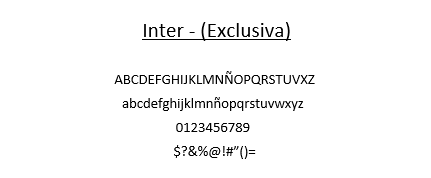
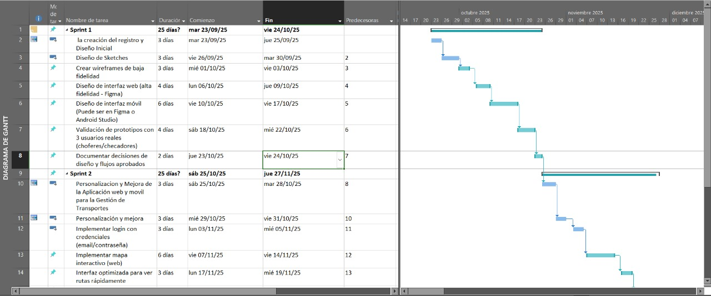
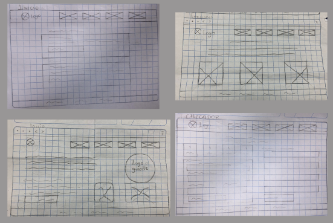
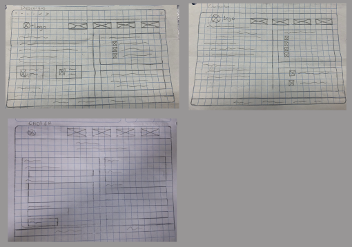

# Proyecto Auto-Récord

## Identidad Gráfica 

La identidad visual de Auto-Record está diseñada para transmitir control, confianza y profesionalismo, valores clave en un sistema enfocado a la administración y monitoreo de flotillas vehiculares.

<table>
   <td>Logo del Proyeto</td>
   <td>Logo Empresarial</td>
  <tr>
    <td>    </td>
    <td>    </td>
   
  </tr>
 
</table>

---

## Paleta de Colores  

La paleta de colores de Auto-Récord ayudan a que el usuario perciba el sistema como confiable, serio y fácil de usar, reduciendo la fricción visual y favoreciendo la concentración en tareas operativas.

---

## Tipografía

La tipografía responde a decisiones estratégicas de diseño centradas en la identidad de marca, la legibilidad, la coherencia visual y la experiencia de usuario. 

---

## Descripción General 

**Auto-Record** es una aplicación web diseñada para optimizar la administración, el monitoreo y el control operativo de flotillas de transporte, especialmente en contextos donde la organizacióny la eficiencia son fundamentales. El sistema surge como una solución tecnológica orientada a centralizar la información clave de las unidades, los viajes y los responsables de operación, reduciendo el uso de registros manuales y minimizando errores en la gestión diaria.

La plataforma permite llevar un control preciso de los horarios de inicio y fin de viaje, el estado de las unidades (activas, inactivas o en mantenimiento) y el registro de incidencias o fallas reportadas por el administrador (checador). Auto-Record está pensado para distintos roles de usuario, como dueños, administradores y checadores ofreciendo interfaces específicas según sus funciones, lo que garantiza un uso más eficiente y seguro de la información.

Desde el punto de vista tecnológico, Auto-Record prioriza la integridad de los datos y la claridad en la visualización de la información mediante reportes y métricas que apoyan la toma de decisiones. Su diseño busca una experiencia de usuario intuitiva, con flujos simples y una identidad visual sobria que transmite confianza y profesionalismo.

Además, el sistema contribuye a una mejor planificación operativa y financiera, al permitir el análisis histórico de viajes, fallas y rendimiento de las unidades. En conjunto, Auto-Record se posiciona como una herramienta integral que fortalece la gestión del transporte, mejora la comunicación entre los departamentos involucrados y promueve un control más transparente y eficiente de las operaciones diarias.

---

## Objetivo General 

Desarrollar una aplicación web que permita la administración, monitoreo y control eficiente de una flotilla de combis, facilitando la gestión de unidades, choferes, horarios, fallas y estados operativos, beneficiando tanto al dueño como al personal operativo.

---

## Objetivos Específicos 

1. Monitorear el estado de las unidades (activas, inactivas, en mantenimiento).
2. Permitir el registro y seguimiento de fallas reportadas.
3. Mejorar el control operativo del dueño de la flotilla.
4. Reducir errores en registros manuales.
5. Registrar el inicio y fin de jornada de cada unidad.

---

## Organigrama 

---

## Tabla de Roles 

|Integrante|Contacto|Rol|
|------------|--------|---|
|Oliver Sanchez Arrioja|[@OliverSA21](https://github.com/OliverSA21)|Líder del proyecto|
|Jeysi Damaris Lara Cruz|[@Jeysi06](https://github.com//Jeysi06)|Desarrollador Backend|
|Erick Uriel Pérez Valenzuela|[@Erick-tech958](https://github.com/Erick-tech958)|UX/UI Designer|
|Aranza Garrido Gutierrez|[@AraGarrido](https://github.com/AraGarrido)|UX/UI Designer|

---

## Diagram de Gantt 

---

## Requerimientos Funcionales 

Funciones específicas que el sistema debe cumplir.

1. El sistema debe permitir iniciar sesión por rol de usuario.
2. El sistema debe mostrar el estado actual de cada unidad.
3. El sistema debe permitir registrar unidades.
4. El sistema debe registrar horario de inicio de viaje.
5. El sistema debe registrar horario de fin de viaje.
6. El sistema debe permitir el registro de fallas.
7. El sistema debe clasificar fallas por tipo y prioridad.
8. El sistema debe permitir editar el perfil del usuario.
9. El sistema debe permitir cambiar contraseña.
10. El sistema debe permitir cerrar sesión de forma segura.

---

## Requerimientos No Funcionales 

Aspectos de calidad que el sistema debe garantizar.

1. La interfaz debe ser intuitiva y fácil de usar.
2. El sistema debe garantizar la seguridad de los datos.
3. El diseño debe ser consistente en todas las pantallas.
4. El sistema debe permitir mantenimiento sin afectar al usuario. 
5. La información debe almacenarse de forma persistente.

---

## Historias de Usuario  

Descripciones cortas de lo que el usuario necesita y por qué.

1. Como dueño, quiero ver el estado de todas las unidades para tomar decisiones rápidas.
2. Como dueño, quiero consultar reportes de fallas para planificar mantenimiento.
3. Como dueño, quiero administrar choferes para tener control del personal.
4. Como dueño, quiero ver horarios de operación para evaluar desempeño. 
5. Como dueño, quiero ver historial de fallas por unidad.
6. Como dueño, quiero identificar unidades inactivas rápidamente.
7. Como checador, quiero saber si una unidad está habilitada antes de operar.
8. Como checador, quiero ver mi perfil para validar mi información.
9. Como checador, quiero reportar fallas para evitar riesgos.
10. Como checador, quiero registrar el inicio de viaje para llevar control horario.
11. Como checador, quiero registrar el fin de viaje para cerrar la jornada.

---

## Sketches

Dibujos iniciales y rápidos que representan la idea básica de las pantallas sin enfocarse en detalles visuales. Ingresa a este link para visualizar todas las pantallas

---

## Wireframes 

Diagramas más estructurados que muestran cómo estarán organizados los elementos de cada pantalla, sirviendo como puente entre la idea y el diseño final. Ingresa a este link para visualizar todas las pantallas

---

## Mockups 

Versiones más avanzadas y estéticas del diseño, donde ya se incluyen colores, tipografías, íconos e identidad gráfica del proyecto. Ingresa a este link para visualizar todas las pantallas

---

## Prototipo Figma 

Representación navegable e interactiva del sistema que permite simular su funcionamiento: https://www.figma.com/proto/p4c284763CrOIinXHfpl4l/Untitled--Copia---Copy-?node-id=4496-594&p=f&t=GPiawQBH4t2Qx3gh-0&scaling=min-zoom&content-scaling=fixed&page-id=4176%3A10657&starting-point-node-id=4496%3A594

---

## Prototipo Programado 

---

## Presentación 

---

## Conclusión

Auto-Record se plantea como una solución tecnológica integral que responde a la necesidad de mejorar la gestión, el control y la transparencia en la administración de unidades de transporte. A través de una estructura clara de roles, una interfaz intuitiva y el uso adecuado de tecnologías de información, el sistema permite optimizar procesos clave como el monitoreo de viajes, el control de unidades, el registro de fallas y la administración financiera. El diseño del proyecto prioriza la usabilidad, la seguridad de los datos y la eficiencia operativa, sentando bases sólidas para su escalabilidad y futuras mejoras. En conjunto, Auto-Record demuestra cómo el uso estratégico del software puede generar un impacto positivo en la organización, toma de decisiones y calidad del servicio.